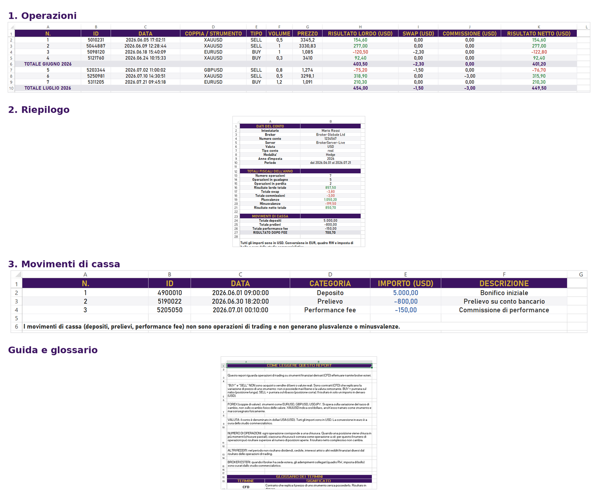

# Trading Tax Report Tools

Suite di strumenti in Python che trasformano i dati di trading esportati da MetaTrader in un report Excel chiaro, ordinato e verificabile, pensato come ausilio alla dichiarazione dei redditi italiana e comprensibile anche da chi non opera nei mercati finanziari (commercialista, CAF, uffici competenti).

**Software proprietario - tutti i diritti riservati. Vedi [LICENSE](LICENSE).**
La repository è pubblica come vetrina del progetto: il codice sorgente è consultabile ma non ne è concesso l'uso, la copia o la modifica senza autorizzazione scritta.

---

## Perché questo strumento

Il report esportato da MetaTrader è un unico foglio denso, che mescola operazioni, ordini non eseguiti, movimenti di cassa e voci tecniche: praticamente illeggibile per chi deve gestirne il lato fiscale. Ho costruito questi strumenti con tre obiettivi precisi:

- **Tenere solo ciò che serve al fisco.** Dal report grezzo vengono estratte le sole informazioni rilevanti per la dichiarazione dei redditi, scartando ordini non eseguiti e voci tecniche della piattaforma che non hanno alcun peso fiscale.
- **Rendere i dati leggibili e granulari.** Le informazioni sono suddivise su quattro fogli tematici (operazioni, riepilogo, movimenti di cassa, guida e glossario), così ogni aspetto è isolato e consultabile, invece di essere compresso in un unico estratto denso.
- **Garantire l'affidabilità del dato.** I totali del report quadrano al centesimo con il riepilogo ufficiale prodotto da MetaTrader (numero di operazioni, risultato netto, plusvalenze e minusvalenze coincidono con lo statement della piattaforma): il documento è verificabile riga per riga.

In più, il report chiarisce i fraintendimenti più comuni: ad esempio che "BUY" e "SELL" su oro o coppie di valute NON sono acquisti o vendite fisiche di beni, ma contratti finanziari (CFD) il cui unico esito è un profitto o una perdita in denaro.

---

## Come ho ottenuto la quadratura

Arrivare a numeri identici a quelli dichiarati da MetaTrader non è stato immediato, ed è parte del valore del progetto. All'inizio leggevo le operazioni dalla sezione "Posizioni" del report, ma i totali non tornavano: alcune operazioni mancavano e il risultato netto non coincideva con lo statement ufficiale.

Analizzando il formato reale del file ho capito il motivo: le posizioni chiuse in più momenti (chiusure parziali) non compaiono nella sezione "Posizioni", ma in quella "Affari", cioè tra i movimenti di chiusura. Spostando la lettura sugli Affari, ogni chiusura viene contata come operazione a sé e tutti i totali quadrano al centesimo con il riepilogo di MetaTrader.

Gli Affari nascondono però una seconda sottigliezza: il verso del movimento di chiusura è invertito rispetto all'operazione. Per chiudere una posizione SELL si esegue un BUY, e per chiudere una BUY si esegue un SELL; nella sezione Affari, quindi, la direzione registrata è l'opposto di quella reale dell'operazione. Lo strumento la re-inverte, così ogni riga riporta il verso corretto (BUY o SELL), coerente con quello mostrato dalla sezione Posizioni.

La soluzione è stata verificata su più conti e su periodi differenti. L'intero percorso - ipotesi iniziale, tentativi e correzione - è tracciabile nella cronologia dei commit del repository.

---

## Esempio di report

Nella cartella [`docs/`](docs/) è disponibile un report d'esempio anonimo ([`report_esempio_anonimo.xlsx`](docs/report_esempio_anonimo.xlsx)) con dati fittizi.

Il documento è composto da quattro fogli: elenco delle operazioni con subtotali mensili, riepilogo fiscale, movimenti di cassa e guida con glossario.

---

## Competenze tecniche dimostrate

- **Python** per l'elaborazione dati end-to-end: dalla sorgente grezza al documento finale.
- **pandas** per strutturazione, raggruppamento e calcolo su dati tabellari.
- **openpyxl** per la generazione di report Excel con formattazione, formule vive (SUM, SUMIF, COUNTIF), formattazione condizionale e fogli multipli.
- **Parsing di formati eterogenei**: connessione diretta all'applicazione MetaTrader 5, lettura di file .xlsx esportati, analisi di estratti .htm.
- **Correttezza verificata**: gestione delle chiusure parziali (una posizione chiusa in più tranche genera più operazioni) e riconciliazione dei totali al centesimo con lo statement ufficiale della piattaforma, testata su periodi diversi.
- **Attenzione al destinatario non tecnico**: il codice non solo calcola, ma produce documentazione (glossario, note esplicative) leggibile da chi non conosce il trading.

---

## Struttura del progetto

Il progetto è organizzato per piattaforma di provenienza dei dati. Tutti i moduli condividono lo stesso motore di analisi e producono lo stesso report Excel a quattro fogli: cambia solo la sorgente.

| Modulo | Sorgente | Stato |
|---|---|---|
| `MetaTrader5/Report da app` | Connessione diretta al terminale MT5 | Prototipo iniziale |
| `MetaTrader5/Report da file` | File .xlsx esportato da MT5 | Pronto - versione principale |
| `MetaTrader4/Report da file` | Estratto conto .htm di MT4 | In sviluppo |

### report-fiscale-mt5-open-app (prototipo)

Prima versione del progetto, oggi considerata un prototipo superato. Si collega al terminale MT5 aperto e loggato e scarica lo storico per un periodo scelto. Funziona, ma lavorandoci ho individuato i limiti che mi hanno portato alla versione da file:

- **Periodo da impostare due volte.** Python non accede alla cache del terminale MT5, quindi l'intervallo di date va impostato sia nell'applicazione sia nello script, e i due vanno allineati a mano.
- **Un solo conto alla volta.** Analizza esclusivamente il conto aperto sul PC in quel momento.
- **Richiede l'accesso diretto al conto.** Il conto deve essere aperto e loggato davanti all'operatore: impraticabile, e potenzialmente un problema di sicurezza, se si deve analizzare l'estratto di qualcun altro.

### report-fiscale-mt5-from-file (versione principale)

Nata per superare i limiti del prototipo live. Analizza un report di cronistoria MT5 esportato in .xlsx, senza collegarsi al terminale. Stesso motore e stesso report della versione live, con tre vantaggi concreti:

- **Nessun accesso al conto.** Basta il file esportato: non serve il terminale aperto né le credenziali, quindi si possono elaborare in sicurezza anche estratti forniti da terzi.
- **Più report insieme.** Può analizzare più estratti nella stessa esecuzione, se collocati nella stessa cartella.
- **Nessun disallineamento di periodo.** Legge esattamente ciò che il file contiene, senza intervalli da sincronizzare.

### report-fiscale-mt4-from-file (in sviluppo)

Analisi dell'estratto conto MT4 esportato in .htm. MetaTrader 4 non dispone della connessione diretta via Python, quindi il flusso è sempre da file.

## Il report Excel prodotto

Ogni modulo genera un file .xlsx con quattro fogli:

- **Operazioni** - dettaglio di ogni operazione (strumento, volume, date, risultato lordo, costi, netto), raggruppato per mese con subtotali; risultati positivi in verde, negativi in rosso.
- **Riepilogo** - dati del conto e totali fiscali, calcolati con formule Excel vive.
- **Movimenti di cassa** - depositi, prelievi e performance fee, tenuti separati dai trade perché non generano plusvalenze o minusvalenze.
- **Guida e glossario** - note di lettura e definizioni dei termini, per rendere il report comprensibile anche a chi non opera nel trading.

---

## Requisiti

- Windows con terminale MetaTrader installato (per il modulo MT5 live).
- Python 3.12 (ambiente Miniconda consigliato).
- Pacchetto ufficiale MetaTrader5 (solo per il modulo MT5 live).
- pandas, openpyxl.

---

## Note

- Tutti gli importi sono espressi nella valuta del conto (tipicamente USD). L'eventuale conversione in euro e gli adempimenti fiscali (quadro RW, imposta di bollo, ecc.) sono di competenza dello studio commercialistico.
- Questi strumenti organizzano ed espongono i dati; NON costituiscono consulenza fiscale.

---

Copyright 2026 Nicola Vessio - Tutti i diritti riservati.